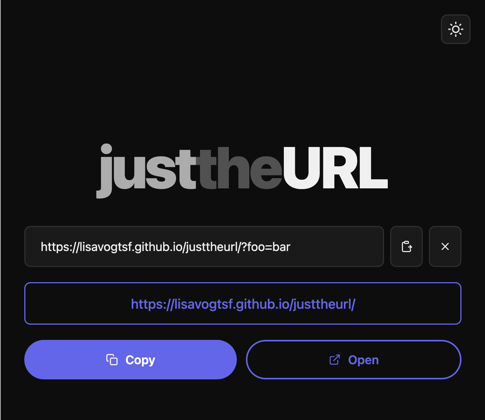

# justtheurl

A minimal tool for cleaning tracking parameters from URLs. It has two modes: **simple** strips everything after the `?`, and **smarter+** removes only known tracking params while preserving the query params the site actually needs.



## LLM/AI Attribution

This README.md and the vast majority of this project were authored by Claude Code (via VSCode and the Claude app).

## What it does

### Simple mode (`/`)

Strips the entire query string and any tracking hash fragment:

```
https://example.com/article?utm_source=twitter&utm_medium=social&utm_campaign=launch
→ https://example.com/article
```

Plain anchor hashes (e.g. `#section-2`) are preserved — only hash fragments that look like key=value tracking params (containing `=`) are removed.

### Smarter+ mode (`/plus`)

Removes only known tracking params (`utm_*`, `fbclid`, `gclid`, `msclkid`, `ttclid`, and others) while preserving query params the site actually needs:

```
https://www.youtube.com/watch?v=dQw4w9WgXcQ&utm_source=twitter&feature=share
→ https://www.youtube.com/watch?v=dQw4w9WgXcQ
```

Site-aware functional params are always kept — for example `v`, `t`, and `list` on YouTube; `q` on Google, Bing, and DuckDuckGo; `keywords` on Amazon. For sites without a known functional param set, only params in the tracking denylist are removed.

In both modes the cleaned URL is automatically copied to your clipboard the moment you paste. On mobile the full flow is a single tap: **Paste → done**.

## Features

Both modes share the same UI and all features below:

- **Two modes** — simple (`/`) strips everything; smarter+ (`/plus`) removes only tracking params and preserves functional ones
- **Auto-copy** — cleaned URL is copied to clipboard when the result changes
- **Paste button** — reads from clipboard directly, no long-press required on mobile
- **Open button** — opens the cleaned URL in a new tab to verify the destination
- **Clear button** — resets the input in one tap
- **Dark/light mode** — toggle in the top-right corner; defaults to your system preference
- **Accessible** — labelled input, `aria-live` output, keyboard-navigable
- **Smart feedback** — shows how many params were removed (e.g. "2 params removed"); shows "already clean" when there's nothing to strip; shows "not a valid URL" for unrecognisable input and skips the clipboard write

## Deployment

The live app is at **[lisavogtsf.github.io/justtheurl](https://lisavogtsf.github.io/justtheurl)** (simple mode) and **[lisavogtsf.github.io/justtheurl/plus](https://lisavogtsf.github.io/justtheurl/plus)** (smarter+ mode).

Both are deployed via GitHub Pages from the `gh-pages` branch root. There is no build step — GitHub Pages serves the HTML files directly. To deploy an update, push the changes to the `gh-pages` branch.

## Running locally

Requires Python 3 (for the dev server) and Node.js (for tests).

```bash
npm install        # install test dependencies
npm run dev        # serve at http://localhost:3000
npm test           # run the test suite
npm run test:watch # run tests in watch mode
```

The app is plain HTML, CSS, and JavaScript with no build step. The dev server is only needed because ES module imports are blocked on `file://` URLs by the browser.

## Project structure

```
index.html                  # simple mode page
plus/index.html             # smarter+ mode page
css/styles.css              # all styling, dark/light theme via CSS custom properties
js/app.js                   # DOM wiring for simple mode
js/url-utils.js             # strip-everything URL logic
js/app-plus.js              # DOM wiring for smarter+ mode
js/url-utils-plus.js        # smart stripping logic (tracking denylist + functional allowlist)
favicon.svg                 # browser tab icon
icons/icons.svg             # SVG sprite (all icons defined once, referenced via <use>)
tests/                      # Vitest test suite (covers both pages and both util modules)
plans/                      # feature planning documents
```

## Testing approach

The project is developed with strict TDD. Tests use [Vitest](https://vitest.dev) and [jsdom](https://github.com/jsdom/jsdom) to load and query the real `index.html`. The test suite covers page structure, accessibility attributes, and all interactive behaviour via `initApp`.
