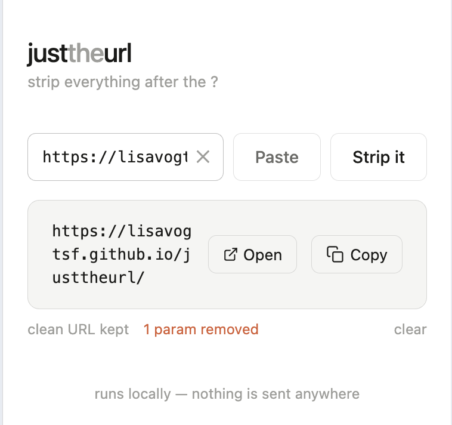

# V1: Claude Generates and Critiques

## Origin

This project began as a research conversation in the Claude macOS app. The starting prompt was a practical question:

> I want an easy way to remove everything after the ? in a URL. Sometimes trying to do this on an iPhone (or other mobile interface) is annoying. Is there a website or an app that can make this really easy? I want to input a URL with lots of query parameters after the '?' and get out a stripped URL. What are my current options (other than physically manipulating the URL in my own text editor)? Do existing options do lots of their own tracking when I use them?

After surveying existing options (browser extensions, online tools, manual editing), Claude offered to build something from scratch:

> If you want something even simpler with no app install, I could also just build you a lightweight single-page tool right here that strips everything after the ? — it would run entirely in your browser with zero tracking.

The user accepted. Claude generated a complete, self-contained `index.html` in the chat window. The user then gave feedback and Claude iterated in the same conversation, producing five more focused commits.

---

## What V1 looked like



The v1 UI is a white card centred on the page. The brand name reads "just**the**url" with "the" rendered in a muted grey — the three-word visual split that carried forward into all later versions. A tagline reads "strip everything after the ?".

The input row contains a text field, a Paste button, and a prominent **Strip it** button. Below the input is a result box showing the clean URL as a clickable link, with **Open** and **Copy** buttons alongside it. A meta row beneath the result shows "clean URL kept" and (in red) how many params were removed. A small "clear" link sits at the far right of that row.

The footer reads "runs locally — nothing is sent anywhere", establishing the privacy framing from the start.

---

## Implementation approach

Everything lived in a single `index.html` file (486 lines in its final state). HTML, CSS, and JavaScript were all inline — no external files, no build step, no dependencies. This was a deliberate choice: a single file is trivial to deploy anywhere, including directly from a GitHub Pages root.

### Parsing logic

Stripping was a manual `indexOf`-based approach:

```javascript
const qIdx    = raw.indexOf('?');
const hashIdx = raw.indexOf('#');

if (qIdx !== -1) {
  base = raw.slice(0, qIdx);
  // split remaining into params and fragment
} else if (hashIdx !== -1) {
  base = raw.slice(0, hashIdx);
  fragment = raw.slice(hashIdx);
} else {
  base = raw;
}
cleanUrl = base + fragment;
```

The hash was always preserved. Query params were counted by splitting on `&` and the count was shown in the meta row. A trailing-slash trim fired when the path was exactly `/`:

```javascript
// strip trailing slash only when path is root
if (cleanUrl.endsWith('/') && new URL(cleanUrl).pathname === '/') {
  cleanUrl = cleanUrl.slice(0, -1);
}
```

### Styling

The initial generation defaulted to **light mode**, using `@media (prefers-color-scheme: dark)` to switch to dark colours automatically. (Later versions flipped this: dark is the explicit default and light is opt-in via a toggle.) Custom properties drove the colour palette — `--bg`, `--text`, `--green`, `--red`, `--warn` — a pattern that carried forward into all subsequent versions.

---

## Commits on this branch

The branch has six commits, each a distinct step in the conversation:

| Commit | What changed |
|---|---|
| `aaa76aa` — *claude initial url strip, copy-paste functionality* | Complete first generation: input + Strip it button, result box, Copy button, meta row, dark/light mode via media query, footer |
| `3bd9fc0` — *claude adds autofocus* | `autofocus` attribute on the text input so the field is focused immediately on page load |
| `10aa1df` — *claude adds inputmode url* | `inputmode="url"` on the input so mobile browsers show a URL-optimised keyboard |
| `7463e99` — *claude adds a paste button* | Paste button reads from `navigator.clipboard.readText()` and populates the input; hides itself after use |
| `08c8dff` — *claude makes result clickable, adds open button* | Result URL becomes an `<a>` tag; Open button added alongside Copy |
| `b6f3b1c` — *claude makes remaining suggested changes* | Six further improvements applied in one commit (see below) |

### The six remaining changes (final commit)

Claude critiqued its own output and proposed improvements; the user approved them all:

1. **Click result box to copy** — the entire result box fires `copyUrl()` on click; clicks on the URL link or Open button are excluded so their navigation still works.
2. **`aria-live="polite"` + `role="status"`** — the result box announces updates to screen readers without interrupting the current task.
3. **Non-URL error state** — when the input contains none of `.`, `/`, `:`, `?`, or `#`, the input gets an amber border and the meta row shows "doesn't look like a URL" in amber. A `--warn` colour token was added to both light and dark palettes.
4. **Inline × clear button** — a `×` appears inside the right edge of the input whenever there is text; clicking it calls `clearAll()`. Right padding on the input was widened to prevent text from sliding under it.
5. **Escape to clear** — pressing Escape in the input field clears everything and returns focus to the input.
6. **Trailing slash trim** — after stripping, `https://example.com/` becomes `https://example.com`. The trim only fires when the path is exactly `/` so paths like `/about/` are untouched.

---

## What this version did not have

| Missing | Added in |
|---|---|
| Automated tests | V2 (Vitest + jsdom TDD introduced) |
| External JS/CSS files | V2 (separated `js/app.js`, `css/styles.css`) |
| Dark mode as the explicit default | V2 |
| Manual theme toggle | V2 |
| Auto-strip on input (no button) | V2 |
| Robust URL parsing via `new URL()` | V4 |
| `invalid` / `clean` / `empty` states | V4 |
| Tracking hash detection | V4 |
| SVG icon sprite | Later refactor |

---

## Key design decisions that survived

- **Single-file deployability** — no build step; GitHub Pages serves `index.html` directly. Subsequent versions added external CSS and JS files but still require no build tooling.
- **Three-word brand split** — "just / the / url" with distinct styling per word.
- **Privacy footer** — "runs locally — nothing is sent anywhere."
- **Paste button** — added in the fourth commit; retained through every version.
- **Open button** — opens the stripped URL in a new tab to verify the destination before sharing.
- **Monospace font for URLs** — result displayed in `ui-monospace` throughout.
- **CSS custom properties for theming** — `--bg`, `--text`, `--green`, `--red` etc.; extended but not replaced in later versions.
